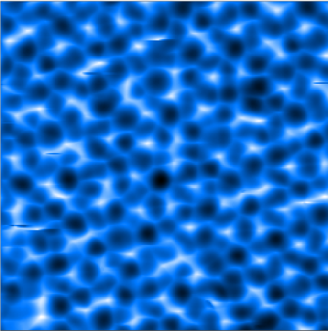

<div align="center">


______________________________________________________________________

<p align="center">
  <a href="">Atomic Reconstruction on AFM Images</a>
</p>


</div>

______________________________________________________________________

## Brief
This project was built to predict the AFM pictures of water, which is put into very low temperture.

## How To Use

### Step 0: Install

Make sure that the cuda is available for the computer doing training.

And using WSL2 or linux system to do it.

You can refer to the websides provided below.

  <a href="https://datawhalechina.github.io/dive-into-cv-pytorch/#/">A guide of pytorch in chinese</a>

  <a href="https://docs.nvidia.com/cuda/wsl-user-guide/index.html#getting-started-with-cuda-o">Cuda installation</a>

  <a href="https://zhuanlan.zhihu.com/p/149848405">zhihu turtorial</a>

After installation, please check the command below to make sure whether it is correct.

```bash
nvcc -V
nvidia-smi
```

If you are using HPC, you can install the latest python via Miniconda.

```bash
# install miniconda
# get the latest conda on the website.
wget https://repo.anaconda.com/miniconda/Miniconda3-latest-Linux-x86_64.sh

# 安装到自己的HOME目录下software/miniconda3中，这个目录在安装前不能存在；
sh Miniconda3-latest-Linux-x86_64.sh -b -p ${HOME}/software/miniconda3

# 安装成功后删除安装包
rm -f Miniconda3-latest-Linux-x86_64.sh

# 将环境变量写入~/.bashrc文件中；
echo "export PATH=${HOME}/software/miniconda3/bin:\$PATH" >> ~/.bashrc

# 退出重新登录或者执行以下命令
source ~/.bashrc
```

Also, it's highly recommended that create a virtual environment for this project.

Example of using virtualenv

```bash
# Creating enviroment
python3 -m venv [env]
# activate it
. ./[env]/bin/activate
```

Some python package are require in this project:

```bash
pip3 install torch torchvision torchaudio -i https://pypi.tuna.tsinghua.edu.cn/simple
pip3 install jupyter tqdm opencv-python matplotlib numpy pandas yacs -i https://pypi.tuna.tsinghua.edu.cn/simple
```

After that, you can try running the program to see if your computer prepare for it.

### Step 1: Using
Make sure that the dataset exists in the father dir. and data dir contains all of the training pictures. The file list has to be named as train_FileList, val_FileList and test_FileList.

```
|--Dataset/
|    |
|    |--data/
|    |
|    |--filelist/
|    |
|    |--label/
|
|--afm_go
|    |
|    |--main.py
|    |
|    |--log/
|    |
|    |--checkpoints/

```

There are several parsers can be used in the program, an example:

```bash
#example1
python3 main.py --mode train --local-epoch 10
#example2
python3 main.py --log-name balanced_local_2gpu.log --batch-size 32 --mode train --worker 12 --model ./model.pkl --dataset bulk_ice --local-epoch 0 --epoch 86 --gpu 0,1
# to see more use
python3 main.py --help
```

______________________________________________________________________

## 写给自己的话/一些经验
- worker就算在linux系统或是在超算上跑都不要设成0，超算上设n-nodes的数目;
- 如果出现了一些很tricky的bug，比如跑几个epoch才报错，建议花点时间把整个算法搬到CPU上，再debug，你真的会找不到到底哪出问题了(主要是显卡上跑算法就算报错print也会全跑光，而且会在同时输出)
- 减少.cuda(),.cpu(),to()的使用，在创建tensor的时候直接在device上创建，真有数据传输的话，要加nonblocking = True。
- 避免使用太多for，能用张量计算就用张量计算，速度快很多，不过不是全部算法都能够这样做就是了，而且可读性会有一定的减低。
- 不要尝试将一切运算都设计成可反向传播的，因为多出来的时间开消远大于模型效能的改善
- 记住你是一个搞物理的人，不要花太多时间在搭系统搞封装，因为科研代码本身就需要疯狂修改，而且后面接手你的工作的人能不能快速看懂又另一个问题了。
- 
