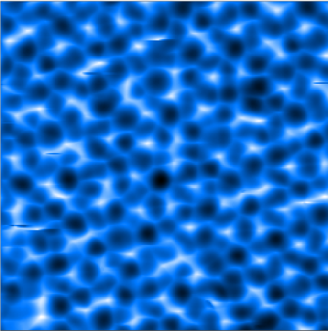

<!-- Improved compatibility of back to top link: See: https://github.com/othneildrew/Best-README-Template/pull/73 -->
<a name="readme-top"></a>
<!--
*** Thanks for checking out the Best-README-Template. If you have a suggestion
*** that would make this better, please fork the repo and create a pull request
*** or simply open an issue with the tag "enhancement".
*** Don't forget to give the project a star!
*** Thanks again! Now go create something AMAZING! :D
-->


<!-- PROJECT SHIELDS -->
<!--
*** I'm using markdown "reference style" links for readability.
*** Reference links are enclosed in brackets [ ] instead of parentheses ( ).
*** See the bottom of this document for the declaration of the reference variables
*** for contributors-url, forks-url, etc. This is an optional, concise syntax you may use.
*** https://www.markdownguide.org/basic-syntax/#reference-style-links
-->
[![Contributors][contributors-shield]][contributors-url]
[![Forks][forks-shield]][forks-url]
[![Stargazers][stars-shield]][stars-url]
[![Issues][issues-shield]][issues-url]
[![MIT License][license-shield]][license-url]
[![LinkedIn][linkedin-shield]][linkedin-url]


<!-- PROJECT LOGO -->
<br />
<div align="center">
  <!-- <a href="https://github.com/supercgor/ARAI">
    
  </a> -->

  <h3 align="center">Atomic Reconstruction on AFM Images (ARAI)</h3>

  <p align="center">
    This project was built to predict the AFM pictures of water, which is put into very low temperture.
    这项目是用于建立 AFM 图像 对 水分子位置 的预测。
    <br />
    <a href="https://github.com/supercgor/ARAI"><strong>Explore the docs »</strong></a>
    <br />
    <br />
    <a href="https://github.com/supercgor/ARAI">View Demo</a>
    ·
    <a href="https://github.com/supercgor/ARAI/issues">Report Bug</a>
    ·
    <a href="https://github.com/supercgor/ARAI/issues">Request Feature</a>
  </p>
</div>


<!-- TABLE OF CONTENTS -->
<details>
  <summary>Table of Contents</summary>
  <ol>
    <li>
      <a href="#about-the-project">About The Project</a>
      <ul>
        <li><a href="#built-with">Built With</a></li>
      </ul>
    </li>
    <li>
      <a href="#getting-started">Getting Started</a>
      <ul>
        <li><a href="#prerequisites">Prerequisites</a></li>
        <li><a href="#installation">Installation</a></li>
      </ul>
    </li>
    <li><a href="#usage">Usage</a></li>
    <li><a href="#roadmap">Roadmap</a></li>
    <li><a href="#contributing">Contributing</a></li>
    <li><a href="#license">License</a></li>
    <li><a href="#contact">Contact</a></li>
    <li><a href="#acknowledgments">Acknowledgments</a></li>
  </ol>
</details>


<!-- ABOUT THE PROJECT -->
## About The Project

This project is still developing. And the backend using to test is PyTorch. There may be some bugs in the code. If you find any bugs, please contact us. Thank you very much. 

This project is mainly developed by: ...


<p align="right">(<a href="#readme-top">back to top</a>)</p>

<!-- GETTING STARTED -->
## Getting Started

### Prerequisites

* Python 3.10
* Cuda 11.3 or 11.7
* PyTorch 2.1.0

### Installation
Clone this repo!
```sh
git clone https://github.com/supercgor/ARAI.git
```


These codes might help you to install the environment for this project.

```sh
    conda create -n afm python=3.10
    conda activate afm
    conda install pytorch torchvision torchaudio pytorch-cuda=11.7 -c pytorch -c nvidia -y
    conda install jupyter matplotlib numpy numba tensorboard tqdm -y
    conda install -c conda-forge hydra-core h5py einops -y
    pip3 install opencv-python

```

<p align="right">(<a href="#readme-top">back to top</a>)</p>

<!-- USAGE EXAMPLES -->
## Usage

Before you start training, you have to edit the `conf/config.yaml` and prepare the dataset with the format of `hdf5`.

Or you can use `compress_dataset.py` to generate the dataset.

```sh
python3 compress_dataset.py [path_to_dataset] --label [True/False] --split [True/False]
```

Then you have to edit the `conf/data/[your_config].yaml` and set the `dataset` to the path of the dataset.

To start training:
```sh
python3 trainv2.py
```

<p align="right">(<a href="#readme-top">back to top</a>)</p>

<!-- ROADMAP -->
## Roadmap

- [ ] Generative model (VAE) for deeper layers
- [ ] More accurate transfer learning method

## TODO
See the [open issues](https://github.com/supercgor/ARAI/issues) for a full list of proposed features (and known issues).

<p align="right">(<a href="#readme-top">back to top</a>)</p>


<!-- CONTRIBUTING -->
## Contributing

Contributions are what make the open source community such an amazing place to learn, inspire, and create. Any contributions you make are **greatly appreciated**.

If you have a suggestion that would make this better, please fork the repo and create a pull request. You can also simply open an issue with the tag "enhancement".
Don't forget to give the project a star! Thanks again!

1. Fork the Project
2. Create your Feature Branch (`git checkout -b feature/AmazingFeature`)
3. Commit your Changes (`git commit -m 'Add some AmazingFeature'`)
4. Push to the Branch (`git push origin feature/AmazingFeature`)
5. Open a Pull Request

<p align="right">(<a href="#readme-top">back to top</a>)</p>

<!-- CONTACT -->
## Contact


<!-- MARKDOWN LINKS & IMAGES -->
<!-- https://www.markdownguide.org/basic-syntax/#reference-style-links -->
[contributors-shield]: https://img.shields.io/github/contributors/othneildrew/Best-README-Template.svg?style=for-the-badge
[contributors-url]: https://github.com/othneildrew/Best-README-Template/graphs/contributors
[forks-shield]: https://img.shields.io/github/forks/othneildrew/Best-README-Template.svg?style=for-the-badge
[forks-url]: https://github.com/othneildrew/Best-README-Template/network/members
[stars-shield]: https://img.shields.io/github/stars/othneildrew/Best-README-Template.svg?style=for-the-badge
[stars-url]: https://github.com/othneildrew/Best-README-Template/stargazers
[issues-shield]: https://img.shields.io/github/issues/othneildrew/Best-README-Template.svg?style=for-the-badge
[issues-url]: https://github.com/othneildrew/Best-README-Template/issues
[license-shield]: https://img.shields.io/github/license/othneildrew/Best-README-Template.svg?style=for-the-badge
[license-url]: https://github.com/othneildrew/Best-README-Template/blob/master/LICENSE.txt
[linkedin-shield]: https://img.shields.io/badge/-LinkedIn-black.svg?style=for-the-badge&logo=linkedin&colorB=555
[linkedin-url]: https://linkedin.com/in/othneildrew
[product-screenshot]: images/screenshot.png
[Next.js]: https://img.shields.io/badge/next.js-000000?style=for-the-badge&logo=nextdotjs&logoColor=white
[Next-url]: https://nextjs.org/
[React.js]: https://img.shields.io/badge/React-20232A?style=for-the-badge&logo=react&logoColor=61DAFB
[React-url]: https://reactjs.org/
[Vue.js]: https://img.shields.io/badge/Vue.js-35495E?style=for-the-badge&logo=vuedotjs&logoColor=4FC08D
[Vue-url]: https://vuejs.org/
[Angular.io]: https://img.shields.io/badge/Angular-DD0031?style=for-the-badge&logo=angular&logoColor=white
[Angular-url]: https://angular.io/
[Svelte.dev]: https://img.shields.io/badge/Svelte-4A4A55?style=for-the-badge&logo=svelte&logoColor=FF3E00
[Svelte-url]: https://svelte.dev/
[Laravel.com]: https://img.shields.io/badge/Laravel-FF2D20?style=for-the-badge&logo=laravel&logoColor=white
[Laravel-url]: https://laravel.com
[Bootstrap.com]: https://img.shields.io/badge/Bootstrap-563D7C?style=for-the-badge&logo=bootstrap&logoColor=white
[Bootstrap-url]: https://getbootstrap.com
[JQuery.com]: https://img.shields.io/badge/jQuery-0769AD?style=for-the-badge&logo=jquery&logoColor=white
[JQuery-url]: https://jquery.com 


<div align="center">


______________________________________________________________________

<p align="center">
  <a href="">Atomic Reconstruction on AFM Images</a>
</p>

</div>

______________________________________________________________________

## Brief
This project was built to predict the AFM pictures of water, which is put into very low temperture.

这项目是用于建立 AFM 图像 对 水分子位置 的预测。

## Prerequisites
- Python 3 (tested with Python 3.10)
- PyTorch (tested with torch v2.0)
- Python packages as specified in [requirements.txt](requirements.txt)

## Installation
```
$ git clone https://github.com/supercgor/ARAI.git
$ cd ARAI
$ sudo pip3 install -r requirements.txt
```

## Prepare for datasets
The path of data should be formatted as follow:
```
data/
  dataset1/
    *.filelist
    afm/
      imgs1/
        0.png
        1.png
        ...
      imgs2/
        0.png
        1.png
        ...
      ...
    label/
      imgs1.poscar
      imgs2.poscar
      ...
    datapack/ (optional)
      imgs1.npz
      imgs2.npz
      ...
    result/ (optional)
      modelname/
        imgs1.poscar
        imgs2.poscar
      ...
```

## Prepare for the models
The model is placed in ARAI/model/pretrain/modelname, dir modelname should contain:
```
modelname/
  a.pkl
  b.pkl
  *.log (optional)
  runs/ (optional)
```

## Prepare for training
You have to set up the config.py & wm.py according your computer condition. There are the codes you may need to change:
```python
# checkpoint name
_C.model.checkpoint = "the model dir name"
# use net
_C.model.fea = "the model name in that dir"
_C.model.reg = "the model name in that dir"
_C.model.cyc = "the model name in that dir"
```
To start training:
```
$ python3 train.py
$ python3 cycTrain.py
$ python3 cycTune.py
$ python3 test.py --dataset ../data/dataset1 --filelist test.filelist --label False --npy False
```

## Logging
You can check the train.log in model/modelname/ . 

You can also use tensorboard to see more detail training log.
```
$ tensorboard --logdir model/modelname/runs --port 6006
```
______________________________________________________________________

## Contributors
Tang Bin Ze, Qin Mian, Lo Chon Hei

This project is still working and there could be LOTS OF BUGS.